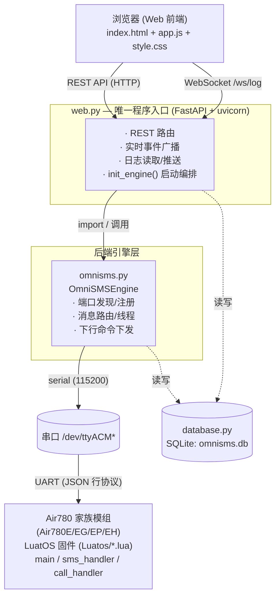

# OmniSMS

基于 **FastAPI + LuatOS(Air780 家族)** 的多设备短信/通话管理系统，统一兼容 **Air780E / Air780EG / Air780EP / Air780EH**（系列识别规则与特性差异详见第十节）。

一个进程同时承载 **Web 管理界面** 与 **设备守护引擎**：通过串口（真实 Air780E 模组）与设备通信，提供设备注册、短信收发、通话控制与实时日志能力。

---

## 一、整体协同架构



### 协同链路说明

1. **唯一入口 `web.py`**：启动后调用 `init_engine()` 拉起 `OmniSMSEngine`（守护引擎），随后 `uvicorn.run()` 提供 Web 服务。
2. **引擎 `omnisms.py`**：周期性扫描真实 USB 串口（`/dev/ttyACM*`）；对每个新端口发送 `identify` 握手并等待 `boot` 事件完成设备注册，随后启动读取线程解析设备上行消息。VUART_0 对应的 `ttyACM` 编号不固定，由 daemon 自动按 VID/PID + 握手发现，部署时不要手动写死端口路径。
3. **设备端**：Air780 家族（Air780E/EG/EP/EH）模组运行同一份 `Luatos/` 固件（按硬件设置 `DEVICE_MODEL` 即可区分系列）。
4. **持久化 `database.py`**：引擎与 Web 共享同一个 SQLite 库，保存设备、短信、通话记录。
6. **前端**：通过 REST API 拉取数据，通过 `WebSocket /ws/log` 接收引擎业务事件与日志的实时推送。

---

## 二、目录结构

```
OmniSMS/
├── web.py              # 唯一入口：FastAPI Web 服务 + 启动编排（拉起引擎）
├── omnisms.py          # 核心守护引擎 OmniSMSEngine（端口发现、消息路由、下行命令）
├── database.py         # SQLite 持久化层（线程安全）
├── requirements.txt    # Python 依赖
├── omnisms.sh          # 管理脚本：虚拟环境/守护进程/源码更新
├── omnisms.service     # systemd 服务模板（开机自启）
├── omnisms.db          # SQLite 数据库文件（运行时生成）
├── logs/               # 按天轮转的日志文件
├── static/
│   ├── app.js          # 前端逻辑：设备/短信/通话/日志 + WebSocket
│   └── style.css       # 前端样式
├── templates/
│   └── index.html      # 单页前端模板（Tailwind CDN）
└── Luatos/             # Air780 家族固件（部署到模组，非宿主进程；四份 .lua 通用于各系列）
    ├── main.lua        # 入口：串口通信层(直接收发无缓冲)、网络信息模块(采集/周期上报)、action 分发、boot 事件、30s 心跳、60s netinfo、指示灯联动
    ├── sms_handler.lua # 短信接收回调上报 / send_sms 下行 / sms_sent_result 结果上报(含长短信分片)
    ├── call_handler.lua# CC_IND 来电/挂断事件上报、dial/hangup 下行执行
    └── util_netled.lua # 网络状态指示灯模块：开机呼吸灯、在线慢闪、等待连接快闪、收发短信/来电活动快闪
```

---

## 三、各模块职责

### 1. `web.py`（唯一程序入口）
- 提供所有 REST API 与 `WebSocket /ws/log`。
- `init_engine()`：构造 `Config` 与 `Database`，创建 `OmniSMSEngine` 并 `start()`。
- `broadcast_engine_event()`：引擎业务事件回调，经 `asyncio.call_soon_threadsafe` 安全地推送到 WebSocket。
- `WebLogHandler` + `LogFileReader`：将日志写入内存缓存、推送前端，并从 `logs/` 目录读取历史日志（按天轮转）。
- 命令行参数：`--host`、`--port`。

### 2. `omnisms.py`（守护引擎）
- `OmniSMSEngine`：
  - `_auto_scan_worker` / `_discover_devices`：后台持续按 VID/PID 列表（默认 `19d1:0001`，覆盖 Air780E/EG/EP/EH）扫描真实 USB 串口；`start_auto_scan()` / `stop_auto_scan()` 控制启停。设备系列由 `classify_series()` 依据固件 `model` 或 IMEI TAC 推断，业务零分支。
  - `_try_register_device`：发送 `identify` 握手 → 等待 `boot` 事件（超时 5s）→ 注册设备并启动读取线程。
  - `_reader_loop` / `_handle_incoming_message`：按行解析 JSON，分发上行事件。
  - 下行接口：`send_sms()`、`make_call()`、`hangup_call()`，经 `_send_command()` 线程安全写入串口。
- `event_callback`：供 Web 层推送实时事件到前端。

### 3. `database.py`（持久化）
- 线程安全 SQLite 封装（`_lock` 串行化 + 每次操作独立连接）。
- 三张表：`devices`、`sms_messages`、`call_records`（详见第五节）。

### 5. `Luatos/*.lua`（设备端固件）
- `main.lua`：入口与模块整合。串口通信层（直接收发、无自定义缓冲区/发送队列，异步发送用 `sys.taskInit`，`uart.VUART_0` @115200）；网络信息模块（采集 IMEI/IMSI/ICCID/本机号码/CSQ/RSSI/RSRQ/RSRP/SNR/频段/`model`，按 `event=netinfo` 上报并响应 `get_netinfo` 动作）；注册 action 分发器（`send_sms`→`sms_handler`、`dial`/`hangup`→`call_handler`、`get_netinfo`→本地处理、`identify`→重发 `boot` 并点亮在线灯）；等待 SIM 注册后发送 `boot`，启动 30s `keepalive` + 60s `netinfo` 统一监控任务；并联动 `util_netled` 指示灯。
- `sms_handler.lua`：注册短信接收回调（`sms_received` 上行，长短信由 `autoLong` 自动合并）、处理 `send_sms` 下行（超 140 字节走 `sms.sendLong`），回报 `sms_sent_result`（`accepted`/`fail` 及 `error_code`/`reason`/`api_ok` 等）；收发短信时触发 `util_netled.active()` 活动快闪。
- `call_handler.lua`：订阅 `CC_IND`（`INCOMINGCALL`/`CONNECTED`/`DISCONNECTED`），上报 `call_incoming`/`call_disconnected`（含 `reason`/`raw_reason`）；处理 `dial`/`hangup` 下行；来电时触发 `util_netled.active()` 活动快闪。
- `util_netled.lua`：网络状态指示灯模块。状态机：上电呼吸灯 → 注册网络后 `init()`(在线慢闪)/`waiting()`(等待连接快闪) → 收发短信/来电 `active()` 临时快闪；引脚/节奏可通过 `PWM_ID`/`LED_GPIO` 与各项 `*_duration`/`*_interval` 配置。

---

## 四、通信协议（JSON 行协议）

- **物理层**：串口波特率 `115200`，8N1；每条消息为一行 JSON，以 `\n` 结尾。
- **上行（LuatOS → Python）**：使用 `event` 字段标识事件类型。

| event | 方向 | 关键字段 | 说明 |
|-------|------|----------|------|
| `boot` | 设备→主机 | `imei`, `iccid`, `imsi`, `number`, `sim_ready`, `net_status`, `rssi`, `rsrp`, `rsrq`, `snr`, `model` | 设备启动/重启，用于注册（`number` 为本机号码，缺失时后端以 `imsi`(卡的标识) 兜底作为 `device_id`，极端再回退 `imei`）；`model` 为设备型号，用于系列标注 |
| `keepalive` | 设备→主机 | `timestamp`, `net_status`, `rssi`, `rsrp`, `rsrq`, `snr`, `imei`, `iccid`, `imsi`, `number`, `model` | 心跳保活（30s） |
| `netinfo` | 设备→主机 | `imei`, `imsi`, `iccid`, `number`, `csq`, `rssi`, `rsrp`, `rsrq`, `snr`, `net_status`, `simid`, `bands`, `band_count`, `model` | 网络信息周期上报（60s）及响应 `get_netinfo` 即时上报 |
| `log` | 设备→主机 | `level`, `tag`, `msg` | 设备运行日志转发 |
| `sms_received` | 设备→主机 | `phone`, `text`, `time`, `metas` | 收到新短信（`metas` 仅长短信含 `refNum`/`maxNum`/`seqNum` 分片信息） |
| `sms_sent_result` | 设备→主机 | `id`, `status`(`accepted`/`fail`), `error_code`, `reason`, `api_ok`, `api_return`, `long_sms`, `net_status`, `rssi`, `iccid` | 短信发送结果（`accepted` 表示已提交网络，`fail` 表示失败；`error_code`/`reason` 标识失败原因） |
| `call_incoming` | 设备→主机 | `phone` | 来电 |
| `call_disconnected` | 设备→主机 | `phone`, `reason`(`hangup`/`busy`/`no_answer`/`dial_failed`), `raw_reason` | 通话结束（`raw_reason` 为模组原始原因码） |

- **下行（Python → LuatOS）**：使用 `action` 字段标识命令类型。

| action | 方向 | 关键字段 | 说明 |
|--------|------|----------|------|
| `identify` | 主机→设备 | — | 握手，触发设备回复 `boot`（仅发现阶段，已启动模组收到后重发 `boot` 并点亮在线灯） |
| `send_sms` | 主机→设备 | `id`, `phone`, `text` | 发送短信 |
| `dial` | 主机→设备 | `id`, `phone` | 拨号 |
| `hangup` | 主机→设备 | — | 挂断 |
| `get_netinfo` | 主机→设备 | — | 请求设备立即上报一次 `netinfo` |

> `omnisms.py` 在发现新端口时会先发 `{"action":"identify"}` 触发握手；真实模组按自身节奏上报 `boot`，忽略未知命令。

---

## 五、数据库表结构

> 设备业务主键为 `device_id`：**本机号码(MSISDN) 优先**，SIM 卡未向模组暴露号码时**回退 IMSI（卡的标识）**，极端情况下再回退 IMEI（设备标识）。前端/API 统一以 `device_id` 寻址；`imei`、`imsi`、`phone` 作为冗余字段保留。

| 表 | 字段 | 说明 |
|----|------|------|
| `devices` | `device_id`(PK), `phone`, `imei`, `iccid`, `at_port`, `log_port`, `status`(`online`/`offline`/`error`), `remark`, `last_seen`, `rssi`, `rsrp`, `rsrq`, `snr`, `net_status`, `imsi`, `csq`, `bands`, `created_at` | 设备注册信息（`device_id` = 本机号码或 IMEI 兜底） |
| `sms_messages` | `id`(PK), `device_id`, `peer_phone`, `text`, `direction`(`in`/`out`), `status`(`pending`/`sent`/`failed`/`received`), `task_id`, `timestamp`, `created_at` | 短信记录（`peer_phone` 为对方号码） |
| `call_records` | `id`(PK), `device_id`, `peer_phone`, `direction`(`in`/`out`), `status`(`ringing`/`dialing`/`connected`/`disconnected`/`missed`), `start_time`, `end_time`, `duration`, `created_at` | 通话记录（`peer_phone` 为对方号码） |

> **迁移**：`database.py` 在初始化时若检测到旧版以 `imei` 为主键的 schema，会自动将旧表重命名为 `_legacy_*` 并重建为 `device_id` 主键，旧数据以原 `imei` 作为 `device_id` 保留（历史短信/通话仍可关联）。

---

## 六、启动方式

### 安装依赖
```bash
python3 -m venv .venv
.venv/bin/pip install -r requirements.txt
```

### 正常启动（连接真实 Air780E）
```bash
.venv/bin/python web.py --host 0.0.0.0 --port 8000
```
- 引擎自动扫描 `/dev/ttyACM*`（VID/PID `19d1:0001`，覆盖 Air780E/EG/EP/EH）并注册设备。
- 浏览器访问 `http://<host>:8000`。

### 命令行参数
| 参数 | 默认值 | 说明 |
|------|--------|------|
| `--host` | `0.0.0.0` | Web 监听地址 |
| `--port` | `8000` | Web 监听端口 |

### 使用管理脚本（`omnisms.sh`）

项目根目录提供 `omnisms.sh`，封装虚拟环境创建、依赖安装、守护进程启停与源码更新，无需手动操作 `.venv`。

```bash
chmod +x omnisms.sh

./omnisms.sh start             # 启动 (自动创建 .venv 并安装依赖, 守护进程方式)
./omnisms.sh stop              # 停止
./omnisms.sh restart           # 重启
./omnisms.sh status            # 查看运行状态
./omnisms.sh logs              # 实时查看日志 (tail -f omnisms.log)
./omnisms.sh update            # 从 GitHub 拉取最新源码覆盖本地并更新依赖, 然后停止 (需手动 start)
```

> 首次 `start` 若检测到 `.venv` 不存在，会自动执行 `python3 -m venv .venv` 并 `pip install -r requirements.txt`；若系统缺少 `python3-venv`，脚本会提示安装方式。

### systemd 开机自启

`omnisms.service` 为 systemd 服务模板（含 `__PROJECT_DIR__` / `__USER__` 占位符）。使用以下命令生成并安装（需 root）：

```bash
sudo ./omnisms.sh install-service   # 替换占位符写入 /etc/systemd/system/omnisms.service 并设为开机自启
sudo systemctl start omnisms        # 启动服务
sudo systemctl status omnisms       # 查看状态
sudo ./omnisms.sh uninstall-service # 卸载服务 (需 root)
```

服务以 `Type=simple` 运行，失败自动重启（`Restart=on-failure`）；日志写入 `omnisms.log`。

---

## 七、REST API 一览

| 方法 | 路径 | 说明 |
|------|------|------|
| GET | `/` | 主页面 |
| GET | `/api/devices` | 设备列表（在线 + 数据库离线/备注合并） |
| GET | `/api/devices/{device_id}` | 单设备详情（`device_id` = 本机号码或 IMEI 兜底） |
| POST | `/api/disconnect` | 删除设备：从引擎内存移除并断开连接，同时从数据库彻底删除 `{device_id}` |
| POST | `/api/devices/remark` | 保存设备备注 `{device_id, remark}` |
| GET | `/api/scan` | 手动扫描：对每个端口独立探测，每个端口最多等待 `duration` 秒（默认 15） |
| POST | `/api/scan/auto/start` | 启动后台自动扫描（引擎启动时已默认开启） |
| POST | `/api/scan/auto/stop` | 停止后台自动扫描（不影响已注册设备） |
| POST | `/api/sms/send` | 发送短信 `{device_id, phone, text}` |
| GET | `/api/sms/conversations?device_id=` | 短信会话（按号码聚合） |
| GET | `/api/sms/messages?device_id=&peer_phone=` | 某会话全部消息 |
| GET | `/api/calls?device_id=` | 通话记录（扁平） |
| GET | `/api/calls/conversations?device_id=` | 通话会话（按号码聚合） |
| POST | `/api/call/dial`（`/api/call/make`） | 拨号 `{device_id, phone}` |
| POST | `/api/call/hangup` | 挂断 `{device_id}` |
| GET | `/api/logs` | 历史日志（过滤/分页） |
| GET | `/api/logs/cache` | 最近日志缓存 |
| GET | `/api/logs/files` | 日志文件列表 |
| POST | `/api/logs/clear-cache` | 清空内存日志缓存 |

### WebSocket 事件（`/ws/log`）
前端实时接收以下 `type`：
- `log`：`{timestamp, level, logger, message, module}`
- `device_event`：`boot` / `keepalive` / `disconnect`
- `sms_event`：`sms_received` / `sms_sent_result`
- `call_event`：`call_incoming` / `call_disconnected`

---

## 八、配置项（`omnisms.py` 的 `Config`）

| 配置 | 默认值 | 说明 |
|------|--------|------|
| `BAUD_RATE` | `115200` | 串口波特率 |
| `SCAN_INTERVAL_SEC` | `3.0` | 端口扫描间隔 |
| `SERIAL_TIMEOUT` | `1.0` | 串口读取超时 |
| `BOOT_TIMEOUT` | `5.0` | 等待首个固件事件超时（不限于 boot，也接受 keepalive/log 等存活事件） |
| `BOOT_RETRY_TIMEOUT` | `10.0` | 识别到存活事件后补发 identify、延长等待 boot 的超时 |
| `RESCAN_KNOWN_GROUP_SEC` | `60.0` | 已确定但注册失败的设备组，降低频率重新探测的间隔 |
| `LUAT_VID` / `LUAT_PID` | `0x19D1` / `0x0001` | Air780 家族 USB 过滤（历史字段，始终纳入匹配） |
| `LUAT_VID_PID_LIST` | `[(0x19D1, 0x0001)]` | 兼容的 USB VID/PID 列表，覆盖 Air780E/EG/EP/EH；如需支持更多变体在此追加 `(vid, pid)` 元组 |
| `PORT_PATTERN` | `/dev/ttyACM\d+` | 真实串口匹配 |
| `DB_PATH` | `omnisms.db` | 数据库路径 |
| `LOG_DIR` / `LOG_FILE` | `logs` / `logs/omnisms.log` | 日志目录/文件 |

---

## 九、已知限制 / 备注

- 设备仅由引擎自动发现注册（真实 USB 串口），不支持手动指定串口路径。
- 真实硬件部署时，需将 `Luatos/` 下四个 `.lua`（`main` / `sms_handler` / `call_handler` / `util_netled`）烧录到 Air780 家族模组，并按硬件设置 `main.lua` 中的 `DEVICE_MODEL`，随后运行 `sys.run()`。

---

## 十、设备系列支持（Air780E / Air780EG / Air780EP / Air780EH）

OmniSMS 在不重复开发的前提下，统一兼容 **Air780E、Air780EG、Air780EP、Air780EH** 四个系列。

> 核心结论：**这四个系列的底层逻辑与架构完全一致**，共用同一套 LuatOS API、相同的 USB 枚举方式与相同的 JSON 串口协议。因此 OmniSMS 采用「统一处理 + 系列标注」策略，业务代码零分支，仅在元数据层面区分系列，便于前端展示与后续按系列扩展（如特定射频参数）。

### 1. 各系列特性差异说明

差异仅存在于**芯片平台、外设资源与封装**层面，**不影响短信 / 通话 / 网络诊断业务**，因此无需在业务代码中区分。

| 系列 | 芯片平台 | 网络制式 | 封装 | 关键差异 | 业务影响 |
|------|----------|----------|------|----------|----------|
| **Air780E** | EC618 | LTE Cat.1 bis | LCC + 32pin LGA | 基础版，单卡单待 | 无（基准） |
| **Air780EG** | EC618 | LTE Cat.1 bis | LCC + 32pin LGA | 集成 **GNSS** 定位 | 无（定位为独立功能，不干扰短信/通话） |
| **Air780EP** | EC718 | LTE Cat.1 bis | LCC + 56pin LGA | 更多 GPIO / 外设资源 | 无（资源差异不影响本系统使用的接口） |
| **Air780EH** | EC718 | LTE Cat.1 bis | LCC + 56pin LGA | EC718 + **GNSS** | 无 |

> 若未来某系列需要差异化参数（例如特定频段优选、功耗策略），可在 `AIR780_SERIES` 元数据表中按系列追加字段，并在对应逻辑处读取——现有「零分支」结构可平滑演进为「按系列读取配置」。

### 2. 配置与接入指引

#### 2.1 主机侧（无需改动即可兼容）

- 默认配置已覆盖四系列：`Config.LUAT_VID_PID_LIST` 默认含 `19d1:0001`，端口发现自动识别全部系列。
- 若某变体使用不同的 VID/PID，在 `Config` 中追加元组即可，例如：
  ```python
  LUAT_VID_PID_LIST: list = field(default_factory=lambda: [(0x19D1, 0x0001), (0x19D1, 0x0002)])
  ```
- 若需基于 IMEI TAC 精确标注系列，在 `omnisms.py` 的 `IMEI_TAC_TO_SERIES` 中补充：
  ```python
  IMEI_TAC_TO_SERIES = {
      "12345678": "Air780EG",
      "87654321": "Air780EP",
  }
  ```

#### 2.2 固件侧（按硬件设置型号）

四个系列烧录**同一份** `LuatOS/` 固件。唯一需要按硬件调整的是 `main.lua` 顶部的常量：

```lua
-- 设备型号: 烧录到不同 Air780 系列时修改此处即可
local DEVICE_MODEL = "Air780E"   -- 改为 "Air780EG" / "Air780EP" / "Air780EH"
```

- 该值会通过 `boot` / `keepalive` / `netinfo` 事件上报给主机，用于系列标注。
- 若保持 `"Air780E"` 或留空 `""`，主机将退而使用 IMEI TAC 推断；推断失败则标注为通用 `"Air780"`，**业务功能不受影响**。

#### 2.3 部署步骤

1. 将 `LuatOS/` 下四个 `.lua`（`main.lua` / `sms_handler.lua` / `call_handler.lua` / `util_netled.lua`）烧录到目标模组，并按硬件设置 `DEVICE_MODEL`。
2. 模组通过 USB 接入 Linux 主机，确认枚举出 `/dev/ttyACM*`（权限通常需 `dialout` 组或 `sudo`）。
3. 启动 OmniSMS：
   ```bash
   .venv/bin/python web.py --host 0.0.0.0 --port 8000
   ```
4. 引擎自动扫描并注册设备；在 Web 界面「设备列表」中可看到 `series` / `model` 字段正确标注为对应系列。
5. 如未自动发现，可点击「手动扫描」；如系列标注为通用 `"Air780"`，按上文补充 `IMEI_TAC_TO_SERIES` 或确认固件 `DEVICE_MODEL` 已正确设置。

#### 2.4 验证要点

- 设备列表 API `/api/devices` 返回的每个设备含 `series` 与 `model` 字段。
- 日志中出现 `Air780 family port groups` / `Air780 family port topology changed` 等家族化提示。
- 短信收发、通话控制、网络诊断在四系列上行为一致。
